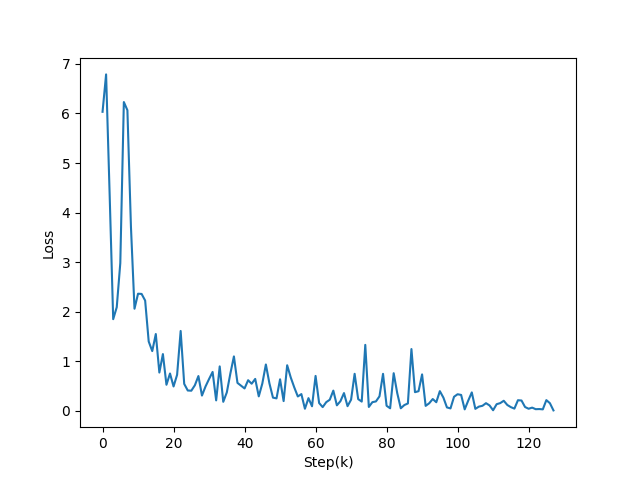

# SVHN-Recognition
[](https://github.com/MuGeminorum/SVHN-Recognition/blob/master/LICENSE)
[](https://github.com/MuGeminorum/SVHN-Recognition/actions/workflows/python-app.yml)
[](https://huggingface.co/spaces/MuGeminorum/svhn)
[](https://www.modelscope.cn/studios/MuGeminorum/svhn)

This project is a PyTorch implementation that uses deep CNN to recognize multi-digit numbers using the SVHN dataset derived from Google Street View house numbers, each picture contains a set of numbers from 0 to 9, the model is tested to have 89% accuracy.

## Environment
```bash
conda create -n svhn --yes --file conda.txt
conda activate svhn
pip install -r requirements.txt
```

## Usage
1. Clone the source code:
```bash
git clone git@github.com:MuGeminorum/SVHN-Recognition.git
cd SVHN-Recognition
```
2. Run `convert_to_lmdb.py`
3. Run `train.py`

## Params
<table>
    <tr>
        <th>Steps</th>
        <th>GPU</th>
        <th>Batch Size</th>
        <th>Learning Rate</th>
        <th>Patience</th>
        <th>Decay Step</th>
        <th>Decay Rate</th>
        <th>Accuracy</th>
    </tr>
    <tr>
        <td>122000</td>
        <td>GTX 1080 Ti</td>
        <td>512</td>
        <td>0.01</td>
        <td>100</td>
        <td>625</td>
        <td>0.9</td>
        <td>89.21%</td>
    </tr>
</table>

## Training curve


## Reference
[1] [Multi-digit Number Recognition from Street View Imagery using Deep Convolutional Neural Networks](http://arxiv.org/pdf/1312.6082.pdf)